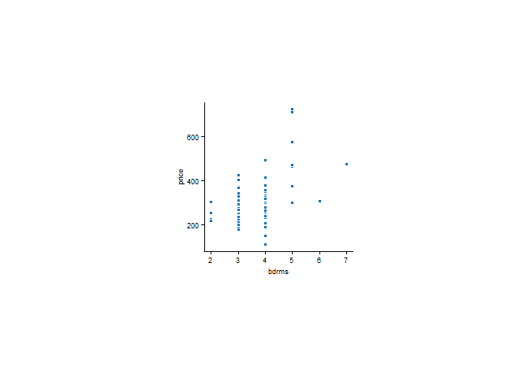

---
author:
- Tiago Afonso
authors:
- Tiago Afonso
date: 2026-03-05
title: Aula de Introdução
toc-title: Table of contents
---

-   [Introdução ao R](#introdução-ao-r)
    -   [Preparar o
        ambiente](#preparar-o-ambiente)
    -   [Primeiros passos](#primeiros-passos)
        -   [Consola vs
            Script](#consola-vs-script)
        -   [Limpar o ambiente do
            `R`](#limpar-o-ambiente-do-r)
        -   [Efetuar cálculos
            básicos](#efetuar-cálculos-básicos)
        -   [Criar objetos no
            `R`](#criar-objetos-no-r)
        -   [Cálculos com
            objetos](#cálculos-com-objetos)
-   [Importar dados
    externos](#importar-dados-externos)
    -   [Instalar biblioteca `readxl` para ler ficheiros Excel. Para
        isso é necessário utilizar a função `install.packages` para
        instalar a
        biblioteca.](#instalar-biblioteca-readxl-para-ler-ficheiros-excel.-para-isso-é-necessário-utilizar-a-função-install.packages-para-instalar-a-biblioteca.)
    -   [Carregar a
        biblioteca](#carregar-a-biblioteca)
    -   [Carregar dados com a funão
        `read_xlsx`](#carregar-dados-com-a-funão-read_xlsx)
    -   [Estatística descritiva das
        variáveis](#estatística-descritiva-das-variáveis)
    -   [Calculos entre colunas de um data
        frame](#calculos-entre-colunas-de-um-data-frame)
-   [Análise de dados](#análise-de-dados)
    -   [Quantas casas têm 3
        divisões?](#quantas-casas-têm-3-divisões)
    -   [Quantas casas têm estilo
        colonial?](#quantas-casas-têm-estilo-colonial)
    -   [Quais os fatores que influenciam positivamente o preço das
        casa?](#quais-os-fatores-que-influenciam-positivamente-o-preço-das-casa)
    -   [Será que a 1ª casa da amostra foi vendida abaixo ou acima do
        preço de
        mercado?](#será-que-a-1ª-casa-da-amostra-foi-vendida-abaixo-ou-acima-do-preço-de-mercado)

# Introdução ao R

## Preparar o ambiente

O R é um software de código aberto para análise de dados, estatística e
visualização. Antes de começar a utilizar o `R` é necessário instalr o
software e uma IDE.

1.  Instalar o `R` através do [Download do
    R](https://cran.r-project.org/) (é necessário escolher o sistema
    operativo)
    -   [Windows](https://cran.r-project.org/bin/windows/base/)
    -   [MacOS](https://cran.r-project.org/bin/macosx/big-sur-arm64/base/R-4.5.2-arm64.pkg)
    -   [Linux](https://cran.r-project.org/bin/linux/)
2.  Instalar uma IDE para programar em `R`. A IDE mais utilizada é o
    RStudio, contudo surgiu, recentemente, uma nova IDE chamada Posit.
    Ambas as IDEs são gratuitas e de código aberto.
    -   [RStudio](https://posit.co/download/rstudio-desktop/)
    -   [Posit](https://posit.co/products/ide/positron/)

Neste momentom o `Posit` é uma IDE mais leve e rápida do que o
`RStudio`.

Uma vista geral do `Posit` pode ser encontrado
[aqui](https://rstudio.github.io/cheatsheets/positron.pdf).

------------------------------------------------------------------------

## Primeiros passos

### Consola vs Script

A consola (painel inferior) é utilizada para executar código de forma
interativa, ou seja, linha a linha. A consolsa permite testar código,
nomralmente é utilizada para executar código que não pretendemos
guardar. Basta pressionar `Enter` para executar o código.

O script (painel superior ou control) é utilizado para escrever código
de forma estruturada, ou seja, em blocos. O script permite guardar o
código e é utilizado para escrever código que pretendemos reutilizar.
Para criar um novo script basta clicar em `File` -\> `New File` -\>
`R File`. Para executar o código do script basta selecionar o código e
pressionar `Ctrl + Enter` (Windows) ou `Cmd + Enter` (MacOS) deste que o
cursor esteja na linha do código que pretendemos executar.

### Limpar o ambiente do `R`

::: cell
``` {.r .cell-code}
# limpar o ambiente
rm(list = ls())
```
:::

Antes de iniciar qualquer projeto no R é importante limpar o ambiente
para evitar conflitos entre variáveis.

### Efetuar cálculos básicos

:::: cell
``` {.r .cell-code}
# efetuar cálculos
2+2
```

::: {.cell-output .cell-output-stdout}
    [1] 4
:::
::::

o `R` funciona como uma calculadora, ou seja, é possível efetuar
cálculos básicos como adição, subtração, multiplicação e divisão.

### Criar objetos no `R`

::: cell
``` {.r .cell-code}
# atribuir o resultado a um objeto (alt + -)
x <- 2
4 -> y
```
:::

### Cálculos com objetos

::: cell
``` {.r .cell-code}
# remover um objeto do ambiente x
rm(x)

# criar novos objetos
y <- 7
w <- 8
x <- y + w
```
:::

# Importar dados externos

::: cell
``` {.r .cell-code}
# remover todas as variáveis do ambiente
rm(list = ls())
```
:::

## Instalar biblioteca `readxl` para ler ficheiros Excel. Para isso é necessário utilizar a função `install.packages` para instalar a biblioteca.

Para instalar é necessário colocar o nome da biblioteca com
`"nome_da_biblioteca"`

::: cell
``` {.r .cell-code}
install.packages("readxl")
```
:::

## Carregar a biblioteca

::: cell
``` {.r .cell-code}
library(readxl)
```
:::

Se uma biblioteca não estiver instalada é necessário instalar a
biblioteca antes de carregar a biblioteca. Caso contrário, o R irá
retornar um erro indicando que a biblioteca não foi encontrada:
`Error in library(readxl) : there is no package called 'readxl'`.

## Carregar dados com a funão `read_xlsx`

::: cell
``` {.r .cell-code}
# importar dados
pcasas <- read_xlsx("hprice1.xlsx")
```
:::

Os dados das casas estão organizados da seguinte forma:

  Variável     Definição
  ------------ ----------------------------------
  `price`      preço da casa (milhares de US\$)
  `assess`     avaliação da casa
  `bdrms`      nº de divisões
  `lotsize`    área do terreno
  `sqrft`      área da casa
  `colonial`   = 1, arquitetura colonial

Para ver as variáveis do dataset basta utilizar a função `colnames`:

:::: cell
``` {.r .cell-code}
colnames(pcasas)
```

::: {.cell-output .cell-output-stdout}
     [1] "price"    "assess"   "bdrms"    "lotsize"  "sqrft"    "colonial"
     [7] "lprice"   "lassess"  "llotsize" "lsqrft"  
:::
::::

## Estatística descritiva das variáveis

:::: cell
``` {.r .cell-code}
#esatística descritiva
summary(pcasas)
```

::: {.cell-output .cell-output-stdout}
         price           assess          bdrms          lotsize          sqrft     
     Min.   :111.0   Min.   :198.7   Min.   :2.000   Min.   : 1000   Min.   :1171  
     1st Qu.:230.0   1st Qu.:253.9   1st Qu.:3.000   1st Qu.: 5733   1st Qu.:1660  
     Median :265.5   Median :290.2   Median :3.000   Median : 6430   Median :1845  
     Mean   :293.5   Mean   :315.7   Mean   :3.568   Mean   : 9020   Mean   :2014  
     3rd Qu.:326.2   3rd Qu.:352.1   3rd Qu.:4.000   3rd Qu.: 8583   3rd Qu.:2227  
     Max.   :725.0   Max.   :708.6   Max.   :7.000   Max.   :92681   Max.   :3880  
        colonial          lprice         lassess         llotsize     
     Min.   :0.0000   Min.   :4.710   Min.   :5.292   Min.   : 6.908  
     1st Qu.:0.0000   1st Qu.:5.438   1st Qu.:5.537   1st Qu.: 8.654  
     Median :1.0000   Median :5.582   Median :5.671   Median : 8.769  
     Mean   :0.6932   Mean   :5.633   Mean   :5.718   Mean   : 8.905  
     3rd Qu.:1.0000   3rd Qu.:5.788   3rd Qu.:5.864   3rd Qu.: 9.058  
     Max.   :1.0000   Max.   :6.586   Max.   :6.563   Max.   :11.437  
         lsqrft     
     Min.   :7.066  
     1st Qu.:7.415  
     Median :7.520  
     Mean   :7.573  
     3rd Qu.:7.708  
     Max.   :8.264  
:::
::::

## Calculos entre colunas de um data frame

::: cell
``` {.r .cell-code}
# somar duas colunas bdrms + lotsize
pcasas$soma <- pcasas$bdrms + pcasas$lotsize
```
:::

É necessário escrever o nome do data frame seguido do operador `$` para
escolher uma coluna específica. Também é possível criar colunas através
da funçpão `mutate` do pacote `dplyr`:

:::::: cell
``` {.r .cell-code}
#install.packages("dplyr")
library(dplyr)
```

::: {.cell-output .cell-output-stderr}

    Attaching package: 'dplyr'
:::

::: {.cell-output .cell-output-stderr}
    The following objects are masked from 'package:stats':

        filter, lag
:::

::: {.cell-output .cell-output-stderr}
    The following objects are masked from 'package:base':

        intersect, setdiff, setequal, union
:::

``` {.r .cell-code}
# criar nova coluna com mutate
pcasas <- pcasas |>
  mutate(soma_2 = bdrms + lotsize)
```
::::::

onde o operador `|>` é utilizado para encadear operações, ou seja, para
passar o resultado de uma operação para a próxima operação. O operador
`|>` "lê-se" **então**.

# Análise de dados

## Quantas casas têm 3 divisões?

Gráfico com tidyplots

:::: cell
``` {.r .cell-code}
library(tidyplots)

pcasas |> 
      tidyplot(x=bdrms, y=price) |>
      add_data_points(white_border = TRUE)
```

::: cell-output-display

:::
::::

## Quantas casas têm estilo colonial?

:::: cell
``` {.r .cell-code}
#frequência absoluta
table(pcasas$colonial)
```

::: {.cell-output .cell-output-stdout}

     0  1 
    27 61 
:::
::::

## Quais os fatores que influenciam positivamente o preço das casa?

Estimar um modelo:

:::: cell
``` {.r .cell-code}
# estimar modelo
m_price <- lm(price ~ lotsize + bdrms + assess+ sqrft + colonial, pcasas)
summary(m_price)
```

::: {.cell-output .cell-output-stdout}

    Call:
    lm(formula = price ~ lotsize + bdrms + assess + sqrft + colonial, 
        data = pcasas)

    Residuals:
         Min       1Q   Median       3Q      Max 
    -105.137  -22.348   -0.817   21.688  203.357 

    Coefficients:
                  Estimate Std. Error t value Pr(>|t|)    
    (Intercept) -4.045e+01  2.159e+01  -1.873   0.0646 .  
    lotsize      5.993e-04  4.971e-04   1.206   0.2314    
    bdrms        9.630e+00  6.916e+00   1.392   0.1676    
    assess       9.041e-01  1.043e-01   8.671 3.25e-13 ***
    sqrft        1.071e-03  1.720e-02   0.062   0.9505    
    colonial     9.548e+00  1.065e+01   0.897   0.3725    
    ---
    Signif. codes:  0 '***' 0.001 '**' 0.01 '*' 0.05 '.' 0.1 ' ' 1

    Residual standard error: 43.51 on 82 degrees of freedom
    Multiple R-squared:  0.8309,    Adjusted R-squared:  0.8206 
    F-statistic: 80.56 on 5 and 82 DF,  p-value: < 2.2e-16
:::
::::

## Será que a 1ª casa da amostra foi vendida abaixo ou acima do preço de mercado?

Ver dados

:::: cell
``` {.r .cell-code}
head(pcasas)
```

::: {.cell-output .cell-output-stdout}
    # A tibble: 6 × 12
      price assess bdrms lotsize sqrft colonial lprice lassess llotsize lsqrft  soma
      <dbl>  <dbl> <dbl>   <dbl> <dbl>    <dbl>  <dbl>   <dbl>    <dbl>  <dbl> <dbl>
    1  300    349.     4    6126  2438        1   5.70    5.86     8.72   7.80  6130
    2  370    352.     3    9903  2076        1   5.91    5.86     9.20   7.64  9906
    3  191    218.     3    5200  1374        0   5.25    5.38     8.56   7.23  5203
    4  195    232.     3    4600  1448        1   5.27    5.45     8.43   7.28  4603
    5  373    319.     4    6095  2514        1   5.92    5.77     8.72   7.83  6099
    6  466.   414.     5    8566  2754        1   6.14    6.03     9.06   7.92  8571
    # ℹ 1 more variable: soma_2 <dbl>
:::
::::

Calcular o valor de mercado das casas

:::: cell
``` {.r .cell-code}
#valor estimado das casas
pcasas$valor <- fitted(m_price)
head(pcasas)
```

::: {.cell-output .cell-output-stdout}
    # A tibble: 6 × 13
      price assess bdrms lotsize sqrft colonial lprice lassess llotsize lsqrft  soma
      <dbl>  <dbl> <dbl>   <dbl> <dbl>    <dbl>  <dbl>   <dbl>    <dbl>  <dbl> <dbl>
    1  300    349.     4    6126  2438        1   5.70    5.86     8.72   7.80  6130
    2  370    352.     3    9903  2076        1   5.91    5.86     9.20   7.64  9906
    3  191    218.     3    5200  1374        0   5.25    5.38     8.56   7.23  5203
    4  195    232.     3    4600  1448        1   5.27    5.45     8.43   7.28  4603
    5  373    319.     4    6095  2514        1   5.92    5.77     8.72   7.83  6099
    6  466.   414.     5    8566  2754        1   6.14    6.03     9.06   7.92  8571
    # ℹ 2 more variables: soma_2 <dbl>, valor <dbl>
:::
::::

Calcular a diferença entre o preço de mercado e o preço praticado

:::: cell
``` {.r .cell-code}
pcasas$resid <- resid(m_price)
head(pcasas)
```

::: {.cell-output .cell-output-stdout}
    # A tibble: 6 × 14
      price assess bdrms lotsize sqrft colonial lprice lassess llotsize lsqrft  soma
      <dbl>  <dbl> <dbl>   <dbl> <dbl>    <dbl>  <dbl>   <dbl>    <dbl>  <dbl> <dbl>
    1  300    349.     4    6126  2438        1   5.70    5.86     8.72   7.80  6130
    2  370    352.     3    9903  2076        1   5.91    5.86     9.20   7.64  9906
    3  191    218.     3    5200  1374        0   5.25    5.38     8.56   7.23  5203
    4  195    232.     3    4600  1448        1   5.27    5.45     8.43   7.28  4603
    5  373    319.     4    6095  2514        1   5.92    5.77     8.72   7.83  6099
    6  466.   414.     5    8566  2754        1   6.14    6.03     9.06   7.92  8571
    # ℹ 3 more variables: soma_2 <dbl>, valor <dbl>, resid <dbl>
:::
::::

Filtra colunas de interesse

:::: cell
``` {.r .cell-code}
#install.packages("tidyverse")
library(tidyverse)
```

::: {.cell-output .cell-output-stderr}
    ── Attaching core tidyverse packages ──────────────────────── tidyverse 2.0.0 ──
    ✔ forcats   1.0.1     ✔ readr     2.1.5
    ✔ ggplot2   4.0.0     ✔ stringr   1.6.0
    ✔ lubridate 1.9.4     ✔ tibble    3.3.0
    ✔ purrr     1.2.0     ✔ tidyr     1.3.1
    ── Conflicts ────────────────────────────────────────── tidyverse_conflicts() ──
    ✖ dplyr::filter() masks stats::filter()
    ✖ dplyr::lag()    masks stats::lag()
    ℹ Use the conflicted package (<http://conflicted.r-lib.org/>) to force all conflicts to become errors
:::
::::

Como selcionar as colunas de interesse

:::: cell
``` {.r .cell-code}
pcasa_2 <- pcasas |>
  select(price, valor, resid)
head(pcasa_2)
```

::: {.cell-output .cell-output-stdout}
    # A tibble: 6 × 3
      price valor  resid
      <dbl> <dbl>  <dbl>
    1  300   330. -29.5 
    2  370   324.  46.1 
    3  191   190.   1.15
    4  195   212. -16.9 
    5  373   302.  70.5 
    6  466.  400.  66.2 
:::
::::
